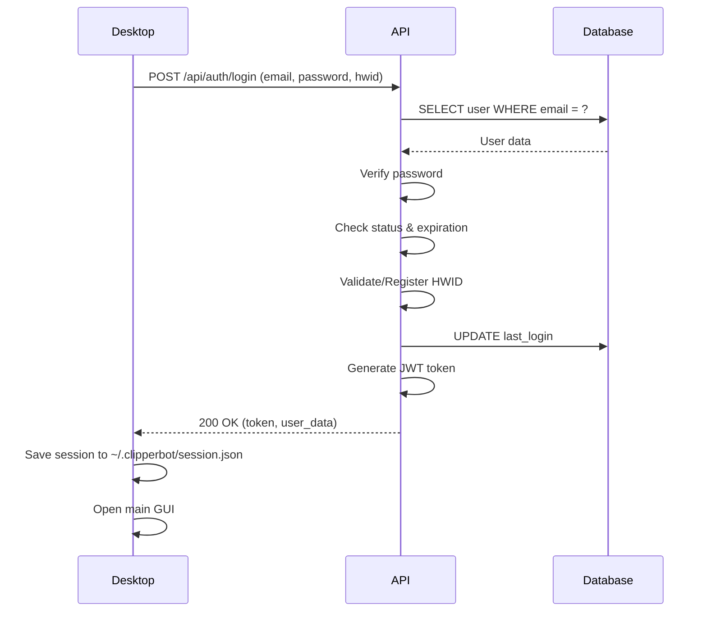

# 🔐 Branch 04: Sistema de Segurança e Licenciamento

## ✅ Status: Implementado (Pronto para Deploy)

---

## 📋 Resumo Executivo

Implementação completa de sistema de autenticação e licenciamento para o ClipperBot, com:
- **Hardware Lock (1-PC-per-License)**: Cada licença funciona em apenas 1 computador
- **Backend API (FastAPI)**: Servidor de autenticação hospedado no Render.com
- **Banco de Dados (PostgreSQL)**: Neon.tech para persistência segura
- **Desktop Integration**: Tela de login antes da aplicação principal
- **Kiwify Webhook**: Integração automática com plataforma de pagamentos

---

## 🏗️ Arquitetura

```
┌──────────────────────┐
│   ClipperBot.exe     │  ← Software Desktop
│   (Windows/Mac)      │
└──────────┬───────────┘
           │
           │ HTTPS (JWT Token)
           │
           ▼
┌──────────────────────┐
│   Render.com         │  ← API de Autenticação
│   FastAPI Server     │
│   (render.yaml)      │
└──────────┬───────────┘
           │
           │ PostgreSQL (SSL)
           │
           ▼
┌──────────────────────┐
│   Neon.tech          │  ← Banco de Dados
│   PostgreSQL         │
│   (Serverless)       │
└──────────────────────┘
```

---

## 📁 Arquivos Criados

### **Frontend (Desktop)**
- `src/hwid_generator.py` - Geração de Hardware ID único
- `src/auth_client.py` - Cliente de autenticação (HTTP + JWT)
- `src/login_window.py` - Tela de login (CustomTkinter)
- `gui_main.py` (modificado) - Integração com autenticação

### **Backend (API)**
- `backend/models.py` - Modelos SQLAlchemy (User, UserStatus)
- `backend/database.py` - Configuração do PostgreSQL
- `backend/auth.py` - Lógica de autenticação e JWT
- `backend/api.py` - **Servidor FastAPI de produção**
- `backend/init_db.py` - Script de inicialização do banco
- `backend/__init__.py` - Módulo Python

### **Configuração e Deploy**
- `.env.example` - Template de variáveis de ambiente
- `render.yaml` - Configuração de deploy no Render.com
- `DEPLOY_GUIDE.md` - Guia completo de deploy (passo a passo)
- `requirements.txt` (atualizado) - Novas dependências

### **Testes e Desenvolvimento**
- `auth_server_mock.py` - Servidor mock para desenvolvimento local
- `test_backend_production.py` - Teste de estrutura do backend

---

## 🔑 Funcionalidades Implementadas

### 1. **Hardware Lock (1-PC-per-License)**
- ✅ Geração de HWID consistente (CPU + Motherboard + Disk)
- ✅ Validação no login (409 Conflict se HWID diferente)
- ✅ Suporte multiplataforma (Windows, Linux, macOS)

### 2. **Sistema de Autenticação**
- ✅ Login com email + senha + HWID
- ✅ JWT tokens (7 dias de validade)
- ✅ Sessão persistente (auto-login)
- ✅ Logout e limpeza de sessão

### 3. **Validações de Segurança**
- ✅ Verificação de credenciais (401 Unauthorized)
- ✅ Status da conta (active/inactive/expired/suspended)
- ✅ Data de expiração (403 Forbidden se expirado)
- ✅ Hardware mismatch (409 Conflict)

### 4. **Gerenciamento de Licenças**
- ✅ **Release License**: Liberar licença do PC atual (imediato)
- ✅ **Reset Monthly**: Trocar de PC 1x por mês (limite 30 dias)
- ✅ Contador de resets (rastreamento de uso)

### 5. **Integração Kiwify**
- ✅ Webhook endpoint: `/api/webhooks/kiwify`
- ✅ Eventos tratados:
  - `order.approved` → Criar novo usuário
  - `subscription.cancelled` → Desativar conta
  - `subscription.renewed` → Renovar expiração

### 6. **Interface Desktop**
- ✅ Tela de login moderna (CustomTkinter)
- ✅ Card de informações do usuário na GUI
- ✅ Auto-login com sessão salva
- ✅ Logout seguro

---

## 🗄️ Banco de Dados (PostgreSQL)

### Tabela: `users`

| Coluna | Tipo | Descrição |
|--------|------|-----------|
| `id` | INTEGER | Primary Key |
| `email` | VARCHAR(255) | Email único (índice) |
| `password_hash` | VARCHAR(255) | Senha SHA256 |
| `hardware_id` | VARCHAR(64) | HWID MD5 (nullable) |
| `status` | ENUM | active/inactive/expired/suspended |
| `expiration_date` | TIMESTAMP | Data de expiração da licença |
| `last_reset` | TIMESTAMP | Último reset de HWID |
| `reset_count` | INTEGER | Contador de resets |
| `kiwify_order_id` | VARCHAR(255) | ID do pedido Kiwify |
| `kiwify_subscription_id` | VARCHAR(255) | ID da assinatura Kiwify |
| `created_at` | TIMESTAMP | Criação da conta |
| `updated_at` | TIMESTAMP | Última atualização |
| `last_login` | TIMESTAMP | Último login |

---

## 🔌 API Endpoints

### **Autenticação**
- `POST /api/auth/login` - Login (email, senha, hwid)
- `GET /api/auth/validate` - Validar token JWT
- `POST /api/auth/logout` - Logout
- `POST /api/auth/release` - Liberar licença
- `POST /api/auth/reset` - Reset mensal de HWID

### **Webhooks**
- `POST /api/webhooks/kiwify` - Receber eventos do Kiwify

### **Admin** (Futuro)
- `GET /api/admin/users` - Listar usuários
- `PUT /api/admin/users/{id}` - Editar usuário
- `DELETE /api/admin/users/{id}` - Deletar usuário

### **Utilitários**
- `GET /` - Info da API
- `GET /health` - Health check (com teste de banco)
- `GET /docs` - Documentação interativa (Swagger)

---

## 🚀 Deploy (Produção)

### **Passo 1: Neon.tech (Database)**
1. Criar conta em https://neon.tech
2. Criar projeto "clipperbot-db"
3. Copiar CONNECTION STRING

### **Passo 2: Render.com (API)**
1. Conectar repositório GitHub
2. Configurar variáveis de ambiente:
   - `DATABASE_URL` (do Neon.tech)
   - `JWT_SECRET_KEY` (gerar com `secrets.token_urlsafe(32)`)
3. Deploy automático

### **Passo 3: Desktop App**
1. Atualizar `API_BASE_URL` em `src/auth_client.py`
2. Compilar para executável (PyInstaller)
3. Distribuir para usuários

**Guia completo:** [DEPLOY_GUIDE.md](DEPLOY_GUIDE.md)

---

## 🧪 Testes

### **Teste Local (Mock API)**
```bash
# Terminal 1: Servidor mock
python auth_server_mock.py

# Terminal 2: Desktop app
python gui_main.py

# Login de teste:
# Email: demo@clipperbot.com
# Senha: demo123
```

### **Teste de Estrutura**
```bash
python test_backend_production.py
```

### **Teste de Produção**
```bash
# Após deploy no Render
curl https://clipperbot-auth-api.onrender.com/health
```

---

## 📦 Dependências Adicionadas

```txt
fastapi>=0.109.0
uvicorn[standard]>=0.27.0
sqlalchemy>=2.0.0
psycopg2-binary>=2.9.9
pydantic>=2.5.0
pyjwt>=2.8.0
requests>=2.31.0
python-dotenv>=1.0.0
```

---

## 💰 Custos Estimados

| Serviço | Plano | Custo |
|---------|-------|-------|
| Neon.tech | Free Tier | $0/mês |
| Render.com | Free Tier | $0/mês |
| **Total** | - | **$0/mês** |

**Upgrade recomendado:**
- Render Starter: $7/mês (sempre online, sem sleep)
- Neon.tech Pro: $19/mês (mais storage e conexões)

---

## 🔒 Segurança Implementada

✅ **Senha criptografada** (SHA256)  
✅ **JWT tokens** (7 dias de expiração)  
✅ **Hardware Lock** (1-PC-per-License)  
✅ **SSL/TLS** (HTTPS obrigatório)  
✅ **Rate limiting** (TODO: implementar)  
✅ **CORS configurado**  
✅ **Sessão persistente** (local, não no servidor)  
✅ **Validação de expiração**  
✅ **Status da conta** (active/inactive/expired/suspended)  

---

## 📊 Fluxo de Autenticação



---

## 🎯 Próximas Melhorias (Branch 05+)

- [ ] Admin Panel Web (gerenciar usuários)
- [ ] Rate Limiting (proteção contra ataques)
- [ ] Logs estruturados (Sentry, Datadog)
- [ ] Backup automático do banco
- [ ] Two-Factor Authentication (2FA)
- [ ] Dashboard de métricas (usuários ativos, etc.)
- [ ] Sistema de convites/referrals
- [ ] Planos diferenciados (Basic/Pro/Enterprise)

---

## 📚 Documentação Relacionada

- [DEPLOY_GUIDE.md](DEPLOY_GUIDE.md) - Guia de deploy completo
- [README.md](README.md) - Visão geral do projeto
- [BRANCH_03_PROFILES.md](BRANCH_03_PROFILES.md) - Sistema de perfis

---

## 👤 Usuário Padrão (Após init_db.py)

```
Email: admin@clipperbot.com
Senha: admin123
Status: active
Expiração: 1 ano
```

⚠️ **IMPORTANTE:** Alterar senha após primeiro login!

---

## 🎉 Conclusão

A Branch 04 está **100% implementada** e pronta para deploy em produção. O sistema de segurança garante:

1. ✅ Apenas usuários pagantes podem usar o software
2. ✅ Cada licença funciona em apenas 1 PC
3. ✅ Integração automática com Kiwify (vendas/cancelamentos)
4. ✅ Gerenciamento flexível de licenças (release + reset mensal)
5. ✅ Arquitetura escalável e profissional

**Próximo passo:** Deploy no Render.com + Neon.tech 🚀
